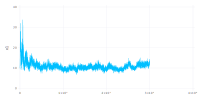
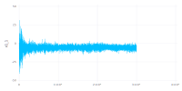
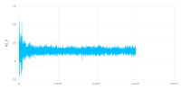
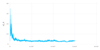

# BridgeSDEInference.jl

MCMC sampler for inference for diffusion processes with the use of Guided
Proposals using the package [Bridge.jl](https://github.com/mschauer/Bridge.jl).
Currently under development.

## Overview

The main function introduced by this package is
```julia
mcmc(setup)
```
It finds the posterior distribution of the unknown parameters given discrete
time observations of the underlying process. Please see the
[documentation (in development)](https://mmider.github.io/BridgeSDEInference.jl/dev).

## Installation
Use the built-in package manager
```julia
using Pkg
Pkg.add("BridgeSDEInference")
```

## Future direction
This package is currently under development, some of the features that are
scheduled to be introduced to a package are:
- Gradient based proposals (for parameter and initial state updates)
- Support for mixed-effects models
- GPU support for efficient treatment of high-dimensional examples
- see [issue #18 (TODOs)](https://github.com/mmider/BridgeSDEInference.jl/issues/18) for an up-to-date list of planned tasks

<!---## Example results
Results of running an inference algorithm for estimating four parameters of the
FitzHugh-Nagumo model (with observational scheme defined in
[this file](scripts/FHN_no_blocking.jl)).

Sampled paths:


And the Markov chains, for parameter ϵ:



parameter s:



parameter γ:



and parameter σ:

-->

## Contributing

Contributions, issues and feature requests are welcome.
Please use [issues page](https://github.com/mmider/BridgeSDEInference.jl/issues) if
you want to contribute or discuss anything package-related.
